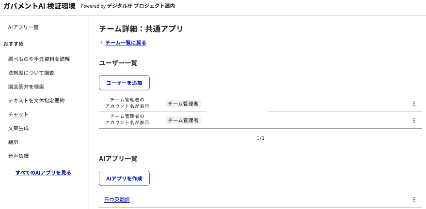
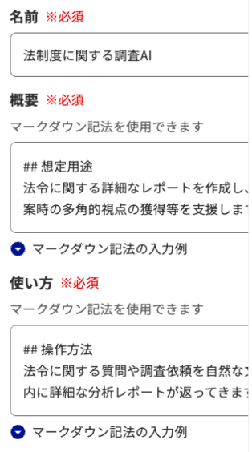
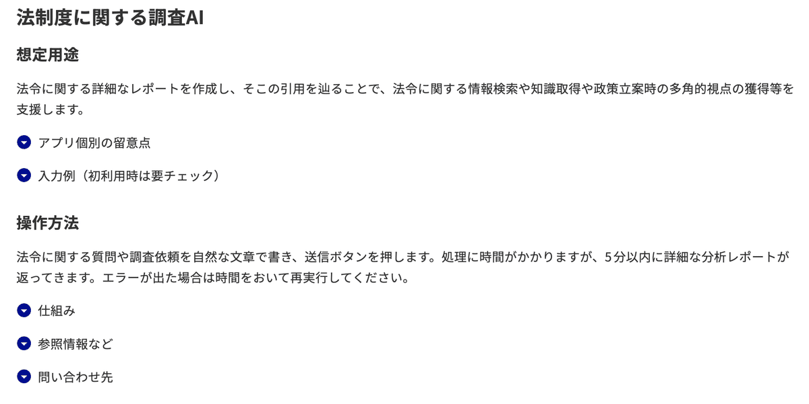
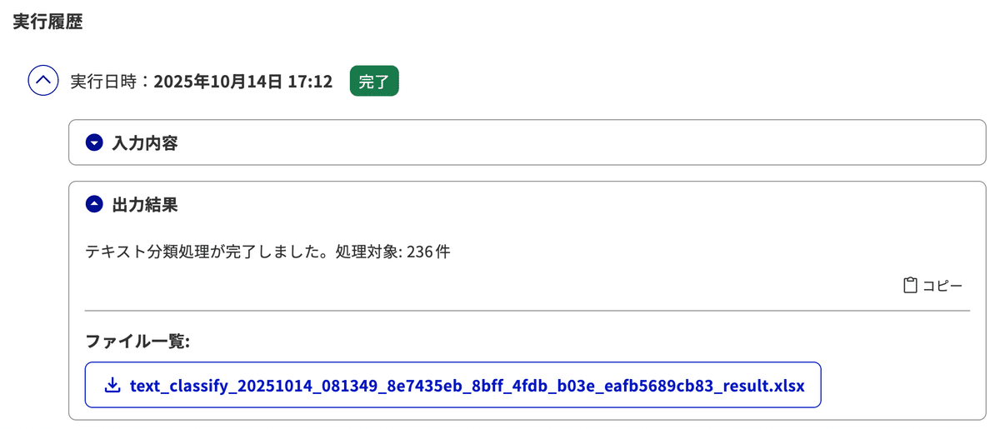

# AI アプリ ローカル開発ガイド（自作 AI アプリの作り方）

> このガイドは、**ローカル版（onpre）** のgenai-web で、個人開発者が **自作の「AI アプリ」（外部 REST API）** を
> 作り、ローカル基盤から実際に呼び出して結果を得るまでを、ひととおり手を動かして辿れるようにまとめたものです。
>
> クラウド（AWS）前提の登録手順は本リポジトリの対象外です。**`docker compose` で動かすローカル運用ではこのガイドを参照してください**。プロトコルの
> 網羅的な定義は [AI アプリ API 仕様](./AIアプリAPI仕様.md) を、UI コンポーネントの一覧は同仕様を併読してください。

---

## 1. 「自作 AI アプリ」とは

genai-web は、**外部の REST API をひとつの「AI アプリ」として登録**し、GUI から呼び出せます。あなたが用意するのは
「`{inputs}` を受け取り、`{outputs}`（テキスト）や `artifacts`（ファイル）を返す HTTP エンドポイント」だけです。
中身は LLM 呼び出しでも、検索でも、定型処理でも構いません。genai-web 側が次を肩代わりします。

- **入力フォームの自動生成**：登録時に渡す「リクエスト形式（JSON）」から、テキスト欄・セレクト・ファイル添付などの
  実行画面を自動で作る。
- **呼び出しと結果表示**：利用者が実行すると、本基盤が `{inputs}` を組み立ててあなたの API へ POST し、返ってきた
  `outputs`（Markdown 可）を整形表示、`artifacts` はダウンロードリンクにする。
- **非同期の面倒見**：時間のかかる処理は「受付（202）→ ステータス確認（polling）→ 完了」の流れを本基盤側のワーカーが
  回す。あなたは「202 を返す」「ステータス URL で進捗を返す」だけでよい。

### 全体像

```
利用者(ブラウザ)
   │  実行
   ▼
genai-web ── POST /api/exapps/invoke ──▶ API（履歴を running で起票・202 即返し）
                                          │ ジョブ投入(キュー)
                                          ▼
                                   ワーカー（worker）
                                          │  ① あなたの endpoint へ POST { "inputs": {...} }
                                          │     ヘッダ: x-api-key / x-user-id
                                          ▼
                                ┌──────────────────────────┐
                                │  あなたの自作 AI アプリ（外部 REST API）  │
                                └──────────────────────────┘
                                          │  同期: 200 { "outputs": "..." }
                                          │  非同期: 202 { ..., "status_url": "/status/<id>" }
                                          ▼
                              ワーカーが履歴を success + outputs/artifacts へ更新
                                          │
                                          ▼
                                  利用者の画面に結果表示
```

ポイントは **本基盤側はワーカー（worker）があなたの API を実際に叩く** という点です。ローカルで動かす場合、ワーカーは
キュー基盤（ElasticMQ）とともに `queue` プロファイルで起動します（後述）。

---

## 2. API 契約（最低限おさえること）

### 2.1 本基盤 → あなたの API（リクエスト）

本基盤は次の形であなたの endpoint へ **POST** します。

```http
POST <あなたのendpoint>
Content-Type: application/json
x-api-key: <登録時に設定した API キー>
x-user-id: <実行ユーザーの安定 ID>

{ "inputs": { "question": "日本の祝日を教えて", "max_length": 200 } }
```

- `inputs` の中身は、登録時の「リクエスト形式」（次節）で定義したキーが入ります。
- `x-api-key` はあなたの API を保護するための共有シークレット。検証するかはあなたの API の自由です。
- 数値は数値型、真偽値は真偽型、チェックボックスの複数選択は `"a,b,c"` のカンマ区切り文字列で届きます
  （詳細は [API 仕様の「注意点」](./AIアプリAPI仕様.md#注意点)）。
- ファイル添付は Base64 で `inputs` 配下に入ります（形式は API 仕様を参照）。

### 2.2 あなたの API → 本基盤（レスポンス）

#### 同期（すぐ結果を返せる場合）

`200` で `outputs`（文字列・Markdown 可）を返すだけです。

```json
{ "outputs": "日本の祝日は元日、成人の日、…" }
```

#### 非同期（時間がかかる場合）

まず `202` で **`status_url`** を返します（本基盤はこれを検知して polling に切り替えます）。

```json
{
  "outputs": "リクエストを受け付けました",
  "request_id": "a1b2c3d4-...",
  "status": "PENDING",
  "status_url": "/status/a1b2c3d4-..."
}
```

本基盤のワーカーは `status_url` に **GET**（`x-api-key` 付き）してステータスを確認します。`status_url` が相対パスなら
endpoint のオリジンに解決されます（例：endpoint が `http://localhost:3000/run` で `status_url` が `/status/x` なら
`http://localhost:3000/status/x` を叩く）。あなたは次を返してください。

- 処理中：`{ "status": "IN_PROGRESS", "progress": "3/5" }`
- 完了：`{ "status": "COMPLETED", "outputs": "...", "artifacts": [{ "contents": "<base64>", "display_name": "report.pdf" }] }`
- 失敗：`{ "status": "ERROR", "error": { "message": "...", "details": "..." } }`

`artifacts` の `contents` は Base64。本基盤側はこれをオブジェクトストレージ（SeaweedFS）へ退避し、履歴には参照を持たせ、
ダウンロードリンクとして提示します（巨大な `outputs` テキストも閾値超で同様に退避）。

> **同期と非同期の分岐は「レスポンス内容」で決まります**（パスは任意）。`202` かつ `status_url` がある → 非同期、
> それ以外の `2xx` → 同期、`4xx/5xx` → エラー。上流の慣習に合わせるなら非同期 endpoint のパスを `/requests` 等に
> しても構いませんが、ローカル版の本基盤はパス名に依存しません。

---

## 3. リクエスト形式（入力フォームの定義）

登録時の「リクエスト形式（JSON）」が、利用者の入力フォームになります。キーが `inputs` のキーに対応します。

```json
{
  "question": {
    "type": "text",
    "title": "質問",
    "desc": "聞きたいことを入力してください",
    "required": true,
    "default_value": "日本の祝日は？"
  },
  "tone": {
    "type": "select",
    "title": "口調",
    "items": [
      { "title": "ていねい", "value": "polite" },
      { "title": "カジュアル", "value": "casual" }
    ],
    "default_value": "polite"
  }
}
```

使えるコンポーネント：`text` / `number` / `textarea` / `file` / `select` / `checkbox` / `radio` / `hidden`。
各パラメータ（`min_length`・`max_size`・`items` 等）は [AI アプリ API 仕様](./AIアプリAPI仕様.md#リクエスト形式定義) を参照してください。

会話を続けたい（疑似チャット）場合は `conversation_history` キーを足します（[API 仕様](./AIアプリAPI仕様.md#会話履歴疑似チャット)）。

---

## 4. 最小実装サンプル（コピペで動く）

「入力をそのまま返す（echo）」最小の AI アプリです。**同期 `/sync`・非同期 `/async`・ステータス `/status/:id`** を
一つのサーバで実装しています。ローカル版にはこの echo サンプルが
`genai-deploy-onpre/examples/echo-exapp/server.mjs`（依存ゼロの Node 標準サーバ）として同梱されています。

### 4.1 Node.js（依存ゼロ）

```js
import { createServer } from 'node:http';
import { randomUUID } from 'node:crypto';

const EXPECTED_API_KEY = process.env.EXPECTED_API_KEY ?? ''; // 空なら検証しない
const jobs = new Map();

const readJson = (req) => new Promise((res) => {
  let b = ''; req.on('data', (c) => (b += c)); req.on('end', () => { try { res(JSON.parse(b || '{}')); } catch { res({}); } });
});
const send = (res, status, obj) => { res.writeHead(status, { 'content-type': 'application/json' }); res.end(JSON.stringify(obj)); };
const auth = (req, res) => { if (!EXPECTED_API_KEY) return true; if (req.headers['x-api-key'] === EXPECTED_API_KEY) return true; send(res, 401, { error: { message: 'invalid api key' } }); return false; };
const echo = (inputs) => `echo: ${Object.values(inputs ?? {}).find((v) => typeof v === 'string') ?? ''}`;

createServer(async (req, res) => {
  const url = new URL(req.url, `http://${req.headers.host}`);

  if (req.method === 'POST' && url.pathname === '/sync') {       // 同期
    if (!auth(req, res)) return;
    const body = await readJson(req);
    return send(res, 200, { outputs: echo(body.inputs) });
  }

  if (req.method === 'POST' && url.pathname === '/async') {      // 非同期: 受付
    if (!auth(req, res)) return;
    const body = await readJson(req);
    const id = randomUUID();
    jobs.set(id, { inputs: body.inputs, polls: 0 });
    return send(res, 202, { outputs: '受け付けました', request_id: id, status: 'PENDING', status_url: `/status/${id}` });
  }

  if (req.method === 'GET' && url.pathname.startsWith('/status/')) { // 非同期: 進捗
    if (!auth(req, res)) return;
    const job = jobs.get(url.pathname.slice('/status/'.length));
    if (!job) return send(res, 404, { error: { message: 'unknown request_id' } });
    if (++job.polls < 2) return send(res, 200, { status: 'IN_PROGRESS', progress: `${job.polls}/2` });
    const contents = Buffer.from(`artifact: ${echo(job.inputs)}`).toString('base64');
    return send(res, 200, { status: 'COMPLETED', outputs: echo(job.inputs), artifacts: [{ contents, display_name: 'result.txt' }] });
  }

  send(res, 404, { error: { message: 'not found' } });
}).listen(3000, () => console.log('listening on :3000'));
```

### 4.2 Python（FastAPI）

```python
import base64, uuid
from fastapi import FastAPI, Request, Header, HTTPException

app = FastAPI()
EXPECTED_API_KEY = ""  # 空なら検証しない
jobs = {}

def echo(inputs: dict) -> str:
    for v in (inputs or {}).values():
        if isinstance(v, str):
            return f"echo: {v}"
    return "echo:"

def check(api_key):
    if EXPECTED_API_KEY and api_key != EXPECTED_API_KEY:
        raise HTTPException(401, "invalid api key")

@app.post("/sync")                       # 同期
async def sync(req: Request, x_api_key: str = Header(default="")):
    check(x_api_key)
    body = await req.json()
    return {"outputs": echo(body.get("inputs", {}))}

@app.post("/async", status_code=202)     # 非同期: 受付
async def async_(req: Request, x_api_key: str = Header(default="")):
    check(x_api_key)
    body = await req.json()
    rid = str(uuid.uuid4())
    jobs[rid] = {"inputs": body.get("inputs", {}), "polls": 0}
    return {"outputs": "受け付けました", "request_id": rid, "status": "PENDING", "status_url": f"/status/{rid}"}

@app.get("/status/{rid}")                # 非同期: 進捗
async def status(rid: str, x_api_key: str = Header(default="")):
    check(x_api_key)
    job = jobs.get(rid)
    if not job:
        raise HTTPException(404, "unknown request_id")
    job["polls"] += 1
    if job["polls"] < 2:
        return {"status": "IN_PROGRESS", "progress": f'{job["polls"]}/2'}
    contents = base64.b64encode(f'artifact: {echo(job["inputs"])}'.encode()).decode()
    return {"status": "COMPLETED", "outputs": echo(job["inputs"]),
            "artifacts": [{"contents": contents, "display_name": "result.txt"}]}
```

### 4.3 ローカルで起動

```bash
# Node の例（上のコードを server.mjs として）
node server.mjs                 # http://localhost:3000

# Python の例
pip install fastapi uvicorn
uvicorn main:app --port 3000    # http://localhost:3000
```

本基盤のコンテナ（ワーカー）から到達できる必要があります。到達経路は次の 3 通りです。

- **同梱 echo サンプルを使う**：`COMPOSE_PROFILES=queue,example` で起動すると、内部名 `http://echo-exapp:3000` で
  到達できます（後述）。
- **ホストで起動したサーバへ**：endpoint を `http://host.docker.internal:3000/...` にします。
- **自分のコンテナを本基盤のネットワークに繋ぐ**：endpoint を `http://<コンテナ名>:3000/...`（内部名）にします。

---

## 5. genai-web への登録

`[アカウント] > [チーム管理] > [チーム一覧]` から対象チームを選び、`[アプリの作成]` で登録します。





主な入力項目：

| 項目 | 説明 | ローカル版での例 |
|---|---|---|
| 名前（name） | 利用者に表示されるアプリ名 | `echo（同期）` |
| API エンドポイント（endpoint） | 本基盤が POST する URL | `http://echo-exapp:3000/sync` / `http://host.docker.internal:3000/sync` |
| API キー（apiKey） | `x-api-key` で送られる共有シークレット | 任意の文字列（検証しないなら何でも可） |
| リクエスト形式（uiFormat） | 入力フォームを生成する JSON | 第 3 節の JSON |
| 概要（description）/ 使い方（howToUse） | 利用者向け説明 | 任意 |
| 公開状態（status） | `draft`（下書き）/ `published`（公開） | `published` |
| コピー可（copyable） | 他ユーザーが複製可能か | 任意 |
| systemPrompt / systemPromptKeyName | 任意のシステムプロンプト | 省略可 |

> **ローカル版では endpoint に `http://localhost` / `http://host.docker.internal` / 内部コンテナ名 / プライベート IP を
> 登録できます**（公開運用は https を推奨）。これを許可するには本基盤側の SSRF 設定が必要です（次節）。

登録に成功すると、`リクエスト形式` から利用者向けの実行画面が自動生成されます。



非同期アプリの実行結果はステータス更新つきで表示されます。



---

## 6. ローカル版の本基盤側設定（SSRF とキュー）

自作 AI アプリを **ローカル宛（localhost / プライベート / 内部ホスト）** で呼ぶには、本基盤側で 2 つを設定します。
設定は `genai-deploy-onpre/.env` に書き、ワーカー（と API）へ渡ります。

### 6.1 ローカル宛の許可（SSRF ガードの緩和）

本基盤は既定で **localhost / プライベート宛をブロック**します（安全側）。ローカルの自作アプリを叩くには、許可を opt-in し、
宛先をホワイトリストで明示します。

```dotenv
# 既定 false。true でローカル/プライベート宛を「許可リストに載っている宛先に限り」許可
EXAPP_ALLOW_PRIVATE_ENDPOINTS=true
# 許可する宛先（ホスト名 or IPv4 CIDR、カンマ区切り）
EXAPP_ENDPOINT_ALLOWLIST=echo-exapp,host.docker.internal,127.0.0.1,192.168.0.0/24
```

| 環境変数 | 既定 | 説明 |
|---|---|---|
| `EXAPP_ALLOW_PRIVATE_ENDPOINTS` | `false` | ローカル/プライベート宛を許可するか。`false` のままだと公開（グローバル）宛のみ |
| `EXAPP_ENDPOINT_ALLOWLIST` | （空） | 許可する宛先。ホスト名完全一致 or IPv4 CIDR。`true` 時のゲート |
| `EXAPP_HTTP_TIMEOUT_MS` | `30000` | 外部 HTTP のタイムアウト（ms） |
| `EXAPP_ARTIFACT_THRESHOLD_BYTES` | `10240` | `outputs` をストレージ退避する閾値（10KB） |
| `EXAPP_APIKEY_ENC_KEY` | （空） | 設定すると登録時の API キーを AES-256-GCM で暗号化保存。空なら平文（localhost 単独運用の既定）。`base64(32B)` か `hex(64桁)` |

> **セキュリティ注意**：`EXAPP_ALLOW_PRIVATE_ENDPOINTS=true` は SSRF の防御を緩めます。**localhost 単独運用が前提**で、
> 許可リストに**自分が立てた宛先だけ**を載せてください。公開運用では `false`（既定）に戻し、自作アプリは https の
> 公開エンドポイントにします。本基盤側はリダイレクト追従を禁止（fail-closed）していますが、DNS 名の再解決
> （DNS rebinding）までは防ぎません。

### 6.2 非同期実行に必要なキュー基盤

自作 AI アプリの呼び出しは **ワーカー** が担うため、キュー（ElasticMQ）とワーカーを `queue` プロファイルで起動します。
同梱 echo サンプルも使うなら `example` も付けます。

```bash
cd genai-deploy-onpre
# api / worker / elasticmq（＋ echo サンプル）を起動
COMPOSE_PROFILES=queue,example \
  docker compose -f docker-compose.yml -f docker-compose.secrets.yml up -d
```

> ローカル版の起動・マイグレーション適用・実機検証の詳細手順は、デプロイ側の
> `genai-deploy-onpre/docs/exapp-invoke-runbook.md` を参照してください。

---

## 7. 動作確認の最短手順（同梱 echo サンプル）

1. `.env` に第 6.1 節の `EXAPP_ALLOW_PRIVATE_ENDPOINTS=true` と `EXAPP_ENDPOINT_ALLOWLIST=echo-exapp` を設定。
2. `COMPOSE_PROFILES=queue,example` でスタックを起動。
3. genai-web でチームを作り、AI アプリを 2 つ登録：
   - 同期：endpoint `http://echo-exapp:3000/sync`
   - 非同期：endpoint `http://echo-exapp:3000/async`
   - リクエスト形式：`{ "question": { "type": "text", "title": "入力", "required": true } }`
4. 各アプリを実行。`question` に入れた文字列が `echo: <入力>` として返れば成功。非同期は数十秒後に完了し、
   `result.txt` がダウンロードできます。

---

## 8. トラブルシュート

| 症状 | 原因と対処 |
|---|---|
| 登録が 500 エラー | DB マイグレーション未適用（API キー保存先テーブルが無い）。`exapp-invoke-runbook.md` のマイグレーション手順を実施 |
| 実行しても「実行中」のまま | ワーカー未起動（`queue` プロファイル漏れ）／キュー（ElasticMQ）に接続できていない |
| 実行が失敗（エラー） | endpoint がブロックされた可能性。`EXAPP_ALLOW_PRIVATE_ENDPOINTS=true` と `EXAPP_ENDPOINT_ALLOWLIST` に宛先を追加。ワーカーログに `exapp_endpoint_blocked` が出ていないか確認 |
| 外部 API に届かない | endpoint のホスト名を見直す（コンテナからは `localhost` ではなく `host.docker.internal` か内部コンテナ名） |
| 非同期がいつまでも完了しない | あなたの API が `status_url` で最終的に `COMPLETED` を返しているか確認。本基盤は受信ごとにバックオフ（既定 30 秒間隔）で polling する |
| 添付ファイルのダウンロードができない | `artifacts` の `contents` が正しい Base64 か、`ARTIFACTS_BUCKET_NAME` のバケットが用意されているか確認 |
| API キーが効かない | あなたの API は `x-api-key` ヘッダで検証する。本基盤に登録した API キーと一致させる |

---

## 9. 関連ドキュメント

- [AI アプリ API 仕様](./AIアプリAPI仕様.md) — プロトコルの網羅的な定義（コンポーネント・型強制・ファイル・非同期の各レスポンス）
- [AI アプリの種類](./AIアプリの種類.md) — 汎用アプリとAI アプリの違い
- [AI アプリ開発ガイド](./AIアプリ開発ガイド.md) — 概要と画面イメージ
- `genai-deploy-onpre/docs/exapp-invoke-runbook.md` — ローカル版の起動・実機検証手順
- `genai-deploy-onpre/examples/echo-exapp/` — 同梱の最小サンプル AI アプリ
