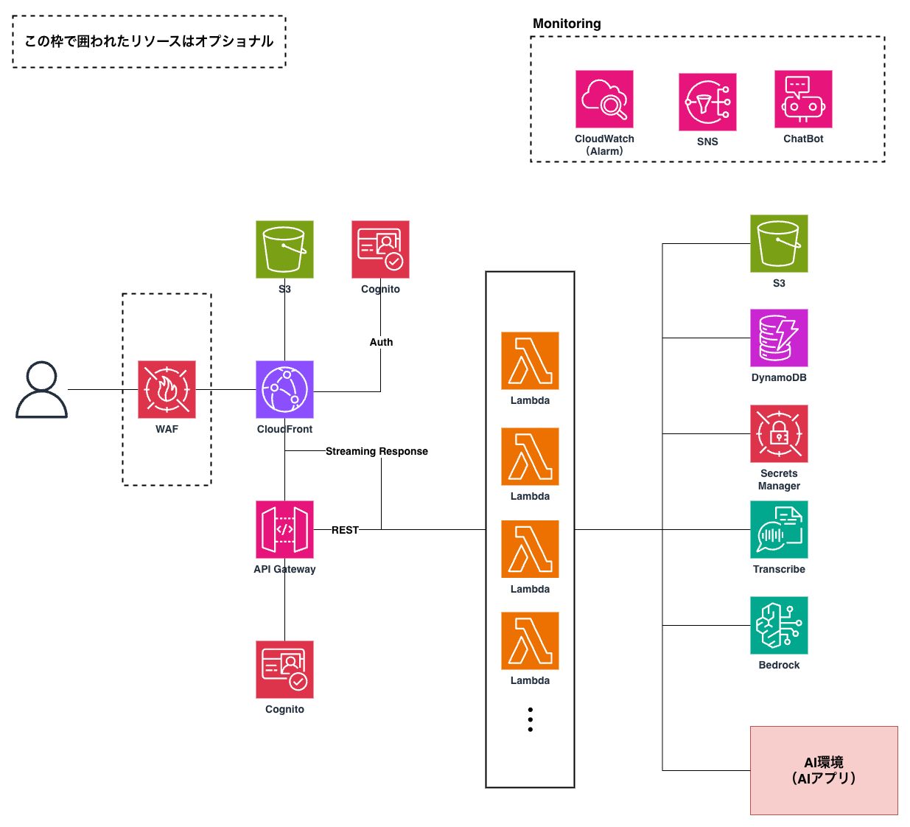

# アーキテクチャ

図は [draw.ioのファイル](./drawio/genai.drawio) として配布しております。必要に応じてダウンロードしてご利用ください。

## 全体概要図

genai-web は「AI インターフェース」として機能し、別リポジトリ([genai-ai-api](https://github.com/digital-go-jp/genai-ai-api))で管理する AI アプリと連携します。

## genai-web（AIインターフェース）概要図

